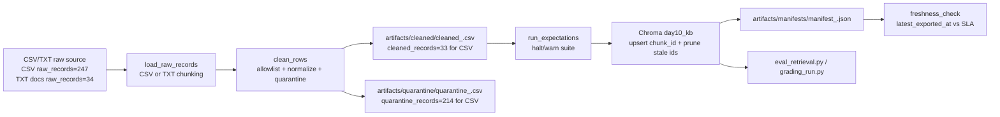

# Kiến trúc pipeline — Lab Day 10

**Nhóm:** _____________
**Cập nhật:** 2026-06-10

---

## 1. Sơ đồ luồng (bắt buộc có 1 diagram: Mermaid / ASCII)

`run_id` được ghi ở log, cleaned CSV, quarantine CSV và manifest. Manifest cũng ghi `raw_source_type` (`csv`, `txt`, hoặc `directory`). Run chuẩn CSV cuối: `after-fix-final`; smoke test TXT: `txt-file-smoke` và `txt-dir-smoke`.

---

## 2. Ranh giới trách nhiệm

| Thành phần | Input | Output | Owner nhóm |
|------------|-------|--------|--------------|
| Ingest | `data/raw/policy_export_dirty.csv`, một file `.txt`, hoặc thư mục `data/docs` | list row raw, `raw_records`, `raw_source_type` | Ingestion / Raw Owner |
| Transform | raw rows + allowlist | cleaned rows, quarantine rows, reason codes | Cleaning & Quality Owner |
| Quality | cleaned rows | expectation result, halt flag | Cleaning & Quality Owner |
| Embed | cleaned CSV | Chroma collection `day10_kb` | Embed & Idempotency Owner |
| Monitor | manifest JSON | PASS/WARN/FAIL freshness | Monitoring / Docs Owner |

---

## 3. Idempotency & rerun

Embed dùng `col.upsert(ids=chunk_id, ...)`, nên cùng `chunk_id` được ghi đè thay vì tạo duplicate. Trước khi upsert, pipeline gọi `col.get(include=[])`, so sánh với ID cleaned run hiện tại và `delete` các vector không còn trong snapshot. Run `after-fix-final` ghi `embed_prune_removed=14`, chứng minh index đã bỏ vector cũ sau khi rule SLA/HR thay đổi.

---

## 4. Liên hệ Day 09

Pipeline publish corpus CS + IT Helpdesk + HR + Access Control vào Chroma collection `day10_kb`. Day 09 agent có thể trỏ retriever sang cùng `CHROMA_DB_PATH` và `CHROMA_COLLECTION` để đọc dữ liệu đã clean thay vì ingest trực tiếp từ export bẩn.

---

## 5. Rủi ro đã biết

- Snapshot mẫu có `latest_exported_at=2026-04-11T00:00:00`; với SLA 24h, freshness FAIL vào ngày chạy 2026-06-10. Đây là dữ liệu lab cũ, không phải lỗi transform.
- Embedding model `all-MiniLM-L6-v2` cần tải từ Hugging Face ở lần đầu.
- Nếu upstream đổi doc_id hợp lệ, phải cập nhật đồng thời contract và allowlist, không chỉ sửa eval.
